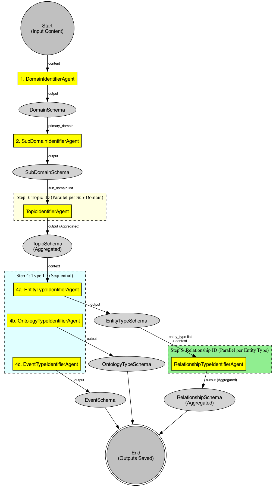
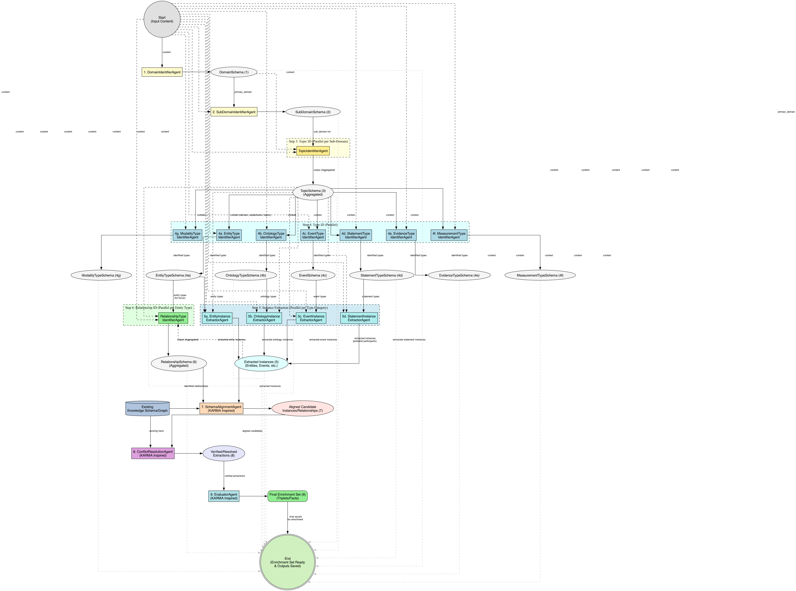

# Graphyte AI: Automated Knowledge Graph Enrichment with Multi-Agent LLMs

[](https://opensource.org/licenses/MIT)
[](https://www.python.org/)
[]()
**Graphyte AI** is a powerful framework leveraging cutting-edge **Multi-Agent Large Language Models (LLMs)** to automate the complex process of **Knowledge Graph (KG) enrichment**. Designed for scalability and accuracy, Graphyte AI transforms unstructured text data, such as scientific literature, news articles, or internal documents, into structured, actionable knowledge integrated seamlessly into your existing KGs. Tackle the information overload and unlock deeper insights with automated knowledge extraction and graph refinement.

---

## Table of Contents

* [Overview](#overview)
* [The Problem: The Knowledge Bottleneck](#the-problem-the-knowledge-bottleneck)
* [The Solution: Graphyte AI](#the-solution-graphyte-ai)
* [Key Features](#key-features)
* [How It Works: Multi-Agent Architecture](#how-it-works-multi-agent-architecture)
* [Technology Stack](#technology-stack)
* [Installation](#installation)
* [Usage](#usage)
    * [Basic Example](#basic-example)
    * [Configuration](#configuration)
* [Use Cases](#use-cases)
* [Contributing](#contributing)
* [License](#license)
* [Contact & Support](#contact--support)
* [Keywords](#keywords)

---

## Overview

In today's data-driven world, **Knowledge Graphs (KGs)** are crucial for organizing, managing, and reasoning over vast amounts of information. However, manually curating and updating these graphs is a labor-intensive, time-consuming process that struggles to keep pace with the exponential growth of unstructured data, particularly in specialized domains like scientific research, finance, and healthcare.

**Graphyte AI** addresses this challenge head-on. By employing a sophisticated **multi-agent system powered by Large Language Models (LLMs)**, it automates the end-to-end pipeline of KG enrichment: from ingesting raw text to identifying entities, extracting relationships, aligning them with existing schemas, resolving conflicts, and integrating verified knowledge into your target graph database.

Our goal is to provide a robust, adaptable, and efficient solution for **automated knowledge discovery** and **KG maintenance**, enabling organizations and researchers to harness the full potential of their data.

## The Problem: The Knowledge Bottleneck

* **Information Overload:** The sheer volume of unstructured text (papers, reports, articles) generated daily makes manual knowledge extraction unsustainable.
* **Scalability Issues:** Manual KG curation doesn't scale effectively.
* **Domain Specificity:** Traditional NLP methods often struggle with specialized terminology and complex, context-dependent relationships found in technical domains.
* **Consistency & Accuracy:** Ensuring the consistency, accuracy, and schema adherence of extracted knowledge is difficult and prone to errors.
* **Integration Complexity:** Integrating newly extracted knowledge into existing, potentially heterogeneous graph structures requires careful validation and conflict resolution.

## The Solution: Graphyte AI

Graphyte AI offers a novel approach using collaborative AI agents:

* **Automated Pipeline:** Handles the entire KG enrichment process from text ingestion to graph integration.
* **Multi-Agent Collaboration:** Divides the complex task among specialized LLM agents (e.g., Entity Extractor, Relation Extractor, Schema Aligner, Conflict Resolver) for improved accuracy and robustness.
* **LLM Power:** Leverages the advanced contextual understanding and reasoning capabilities of modern LLMs.
* **Schema Adherence & Validation:** Includes mechanisms for aligning extracted information with predefined KG schemas and validating its correctness.
* **Conflict Resolution:** Implements strategies for identifying and resolving inconsistencies between newly extracted knowledge and the existing graph.
* **Adaptability:** Designed to be adaptable to different domains and KG schemas through configuration and prompting strategies.

## Key Features

* **Automated KG Enrichment:** Extracts entities and relationships from unstructured text.
* **Multi-Agent LLM Framework:** Utilizes specialized agents for tasks like entity recognition, relation extraction, schema alignment, and conflict resolution.
* **High Accuracy:** Employs cross-agent verification and LLM-based validation to ensure the quality of extracted triples.
* **Scalability:** Designed to process large volumes of documents efficiently.
* **Domain Adaptability:** Configurable for various domains (e.g., biomedical, financial, technical).
* **Schema Alignment:** Maps extracted knowledge to target KG schemas.
* **Conflict Resolution:** Identifies and resolves contradictions with existing knowledge.
* **Modular Design:** Allows for easy extension and customization of the agent workflow.
* **Structured Output:** Generates verified knowledge triples ready for integration into graph databases (e.g., Neo4j, RDF stores).

## How It Works: Multi-Agent Architecture

Graphyte AI employs a workflow orchestrated by a central controller, coordinating multiple specialized agents. A typical flow involves:

1.  **Ingestion Agent:** Retrieves and preprocesses input documents.
2.  **Reader/Summarizer Agents:** Parse relevant sections and potentially create concise summaries.
3.  **Entity Extraction Agent (EEA):** Identifies potential entities (e.g., genes, proteins, companies, people).
4.  **Relationship Extraction Agent (REA):** Identifies relationships between entities (e.g., `treats`, `interacts_with`, `acquires`).
5.  **Schema Alignment Agent (SAA):** Maps extracted entities and relationships to the predefined KG schema types.
6.  **Conflict Resolution Agent (CRA):** Compares new triples with existing KG data, identifies conflicts, and uses LLM reasoning (or predefined rules) to resolve them.
7.  **Evaluator/Integration Agent:** Assesses the final quality and integrates verified triples into the target Knowledge Graph.

This collaborative process, inspired by systems like [KARMA](https://arxiv.org/abs/2502.06472), ensures robustness and high-fidelity knowledge extraction.

## Technology Stack

* **Core:** Python 3.9+
* **AI/ML:** Large Language Models (LLMs) via APIs (e.g., OpenAI, Anthropic, Google Gemini) or local models. Relies on an underlying LLM agent framework (like the one demonstrated in the provided file structure, e.g., `agentic_team`).
* **Potential Libraries:**
    * `pydantic` (Data validation and schema definition)
    * `asyncio` (Concurrent agent execution)
    * `requests`/`httpx` (API communication)
    * `tenacity` (Retry logic)
    * Graph database connectors (e.g., `neo4j`, `rdflib`) - *Depending on integration targets*
    * `python-dotenv` (Environment variable management)

## Installation

```bash
# 1. Clone the repository
git clone [https://github.com/your-username/graphyte-ai.git](https://www.google.com/search?q=https://github.com/your-username/graphyte-ai.git)
cd graphyte-ai

# 2. Create and activate a virtual environment (recommended)
python -m venv venv
source venv/bin/activate  # On Windows use `venv\Scripts\activate`

# 3. Install dependencies
pip install -r requirements.txt

# 4. Setup environment variables
# Create a .env file in the project root directory
# (See .env.example for required variables like API keys)
cp .env.example .env
# Edit .env with your actual API keys and configurations
nano .env
```

*(Detailed instructions for specific LLM provider setup or graph database connections might go here)*

## Usage

Graphyte AI can be run via the command line, processing input from files, directories, or standard input.

### Basic Example

```bash
# Process a single text file
python -m agentic_team_workflow --file path/to/your/document.txt

# Process all readable files in a directory
python -m agentic_team_workflow --dir path/to/your/documents/

# Process input piped from another command or entered manually
cat report.txt | python -m agentic_team_workflow
# Or just run and paste text when prompted:
python -m agentic_team_workflow
```

*(Note: Assumes the main execution script is within a package structure like `agentic_team_workflow` as shown in the provided file structure. Adjust the command if your entry point is different.)*

### Configuration

* **LLM Models:** Configure the specific LLM models used by each agent via environment variables (e.g., `DOMAIN_IDENTIFIER_MODEL`, `RELATIONSHIP_IDENTIFIER_MODEL`). See `.env.example`.
* **API Keys:** Provide necessary API keys in the `.env` file.
* **Output Directories:** Output JSON files for each step are saved in the `outputs/` directory by default.
* **(Advanced):** Modify agent prompts and schemas in the `src/agentic_team_workflow/agents.py` and `src/agentic_team_workflow/schemas.py` files for domain-specific tuning.
* **(Advanced):** Configure target Knowledge Graph connection details for the final integration step (implementation specific).

## Use Cases

Graphyte AI is valuable in various scenarios requiring automated knowledge extraction and KG management:

* **Scientific Research:** Extracting findings, interactions, and relationships from biomedical papers (genes, diseases, drugs).
* **Financial Analysis:** Building KGs of companies, executives, M&A activities, and market trends from news and reports.
* **Competitive Intelligence:** Tracking competitor activities, product launches, and partnerships.
* **Drug Discovery:** Identifying potential drug targets and interactions from research literature.
* **Enterprise Knowledge Management:** Structuring internal knowledge from documents, reports, and wikis.
* **Compliance & Risk Management:** Extracting regulatory information and identifying potential risks.

## Contributing

Contributions are welcome! We aim to build a robust and versatile tool for the community. Please follow these steps:

1.  **Fork the repository.**
2.  **Create a new branch** for your feature or bug fix: `git checkout -b feature/your-feature-name` or `bugfix/issue-number`.
3.  **Make your changes** and add tests if applicable.
4.  **Ensure code quality:** Run linters/formatters (e.g., `black`, `ruff`, `mypy`).
5.  **Commit your changes:** `git commit -m "feat: Add concise description of your change"`.
6.  **Push to your branch:** `git push origin feature/your-feature-name`.
7.  **Open a Pull Request** against the `main` branch of the original repository.

Please read our `CONTRIBUTING.md` file (if available) for more detailed guidelines.

## License

This project is licensed under the **MIT License**. See the [LICENSE](LICENSE) file for details.

## Contact & Support

* **Issues:** Please report bugs or request features using the [GitHub Issues](https://github.com/your-username/graphyte-ai/issues) tab.
* **Questions:** *(Provide an email address, discussion forum link, or other contact methods if desired)*

---

## Keywords

Knowledge Graph, KG, Knowledge Graph Enrichment, Automated Knowledge Extraction, Multi-Agent System, Large Language Models, LLM, AI, Artificial Intelligence, Machine Learning, Natural Language Processing, NLP, Entity Recognition, Relation Extraction, Schema Alignment, Conflict Resolution, Structured Data, Unstructured Data Analysis, Data Integration, Graph Database, Neo4j, RDF, SPARQL, Python, Data Science, Information Extraction, Semantic Technology, Ontology.
## Workflow Diagram

The following diagram illustrates the sequence of agents and data flow in the current workflow:



The workflow progresses through several key phases:

1.  **Context Building (Steps 1-3):**
    * Identifies the primary **Domain**...
    * Determines relevant **Sub-Domains**...
    * Extracts key **Topics**...

2.  **Type Identification (Step 4 - Parallel):**
    * Leverages the established context to identify various conceptual **Types**...

3.  **Instance Extraction (Step 5 - Parallel):**
    * Extracts specific **Instances** or mentions...

4.  **Relationship Identification (Step 6 - Parallel):**
    * Identifies potential **Relationships**...

5.  **Knowledge Enrichment & Verification (Steps 7-9 - KARMA Inspired):**
    * **Schema Alignment (Step 7):** Aligns the extracted instances...
    * **Conflict Resolution (Step 8):** Detects and resolves inconsistencies...
    * **Evaluation & Filtering (Step 9):** Evaluates the verified extractions...

## Agent Workflow Visualization

The diagram below illustrates the multi-agent workflow designed for comprehensive document analysis and knowledge extraction. This workflow aims to be domain-agnostic, processing unstructured text input to produce structured insights suitable for enriching knowledge bases or graphs.




**Key Features:**

* **Multi-Agent Collaboration:** Uses specialized agents for distinct tasks.
* **Parallel Processing:** Employs parallelism...
* **Structured Output:** Generates schemas...
* **Enrichment Focused:** Integrates extraction with verification...

Refer to the diagram above for a detailed visualization of the agents, data structures, and flow between these steps.
